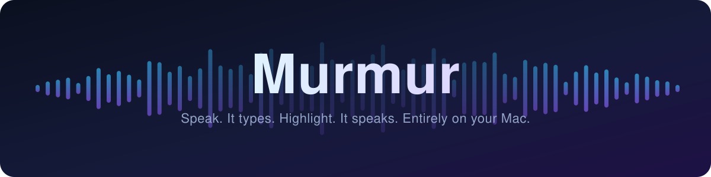
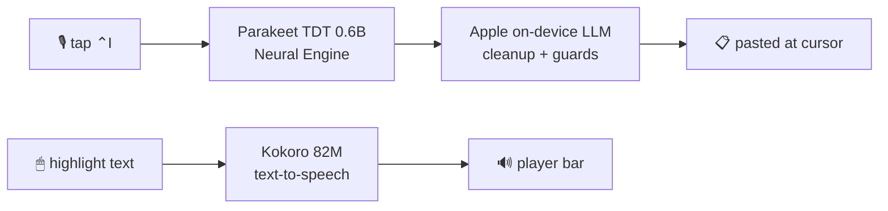

<div align="center">



<br/>
<br/>

**System-wide dictation and text-to-speech for macOS, running entirely on your Mac.**

No cloud. No subscription. No audio ever leaves the machine.

<br/>


</div>

---

Tap a key anywhere in macOS and speak; clean, punctuated text lands at your cursor. Highlight anything and Murmur reads it aloud in a natural voice, with a Speechify-style player. Both directions run on local models, on the Neural Engine.

## Features

- **Dictate anywhere.** Tap <kbd>⌃I</kbd>, talk as long as you like, tap again; the transcript is cleaned up (punctuation, fillers, self-corrections) and pasted into whatever app has focus.
- **Read anything.** Highlight text and it's spoken aloud. A floating player bar gives play/pause, sentence skips, and 0.75×–3× speed with natural pitch.
- **Rewrite in place.** Select text, hold <kbd>⌃O</kbd>, and speak an instruction ("make this more formal"); the selection is replaced with the rewrite.
- **One quiet widget.** A single pill at the bottom of the screen morphs between toggle, level meter, status, and player. No windows, no dock icon.
- **Works where others can't.** Terminals that hide their selections (Warp) are covered by clipboard reading; Firefox and Chromium get their accessibility trees woken up automatically.
- **Guarded cleanup.** A deterministic sanitizer sits behind the LLM and rejects anything that adds, answers, summarizes, or echoes; your words can never be silently rewritten into something you didn't say.
- **Private by construction.** Speech-to-text, cleanup, and text-to-speech are all local models. There is nothing to log in to and nowhere for data to go.

## Keys

| Key | Action |
|---|---|
| <kbd>⌃I</kbd> tap | Start dictating; tap again to insert. Hold works as push-to-talk. |
| <kbd>Esc</kbd> | Discard a recording, or stop an active reading. |
| <kbd>⌃O</kbd> hold | Rewrite the current selection with a spoken instruction. |
| <kbd>⌃Esc</kbd> | Toggle speak-on-highlight mode (same as clicking the pill). |
| <kbd>⌥Esc</kbd> | Read the current selection (or clipboard, in selection-blind apps) now. |

All keys are configurable in Settings.

## How it works



| Stage | Model | Typical time |
|---|---|---|
| Transcription | [Parakeet TDT 0.6B v2](https://huggingface.co/FluidInference/parakeet-tdt-0.6b-v2-coreml) via [FluidAudio](https://github.com/FluidInference/FluidAudio), CoreML/ANE | 90–160 ms, even for long takes |
| Cleanup | Apple FoundationModels (on-device 3B) or [Ollama](https://ollama.com) | 300–1000 ms |
| Insertion | Pasteboard + synthetic ⌘V, clipboard restored | ~10 ms |
| Read-aloud | [Kokoro 82M](https://huggingface.co/mlx-community/Kokoro-82M-bf16) (built-in Heart voice on ANE, or 28 voices via a local [mlx-audio](https://github.com/Blaizzy/mlx-audio) server) | first audio ≲ 1 s |

## Install

Requirements: Apple Silicon, macOS 26+, Xcode 26, [XcodeGen](https://github.com/yonaskolb/XcodeGen).

```sh
git clone https://github.com/Elliot-Sones/Murmur.git
cd Murmur
make install
```

`make install` builds, copies to /Applications, and launches. The onboarding window walks through the three permissions (Microphone, Accessibility, Input Monitoring); grant them to the /Applications copy. Speech models download automatically on first run.

For the full 28-voice Kokoro list, set up the local voice server once (see [`tts-server/README.md`](tts-server/README.md)), then:

```sh
make tts-serve
```

The built-in Heart voice needs no server at all.

If a permission list can't find Murmur: <kbd>⌘⇧G</kbd> in the picker, type `/Applications`, select Murmur.app. If permissions break after a rebuild:

```sh
tccutil reset Accessibility com.elliot.Murmur
tccutil reset ListenEvent com.elliot.Murmur
tccutil reset Microphone com.elliot.Murmur
```

## Beyond dictation

- **Personal dictionary** with suggestions learned from what you actually dictate.
- **Per-app profiles**: tone hints, extra vocabulary, or raw mode per application.
- **History** with per-stage timings (transcribe / cleanup / paste) for every dictation, searchable, with one-click flagging of bad runs.
- **Destination-aware cleanup**: the model knows which app and window it's writing into and matches register.
- **`make bench`**: a word-error-rate harness for comparing speech engines on your own voice recordings.

## Development

```sh
make test      # 145 unit tests
make build     # debug build
make bench     # WER harness (needs fixtures, see bench/README.md)
```

The codebase is Swift 6.2 with strict concurrency, protocol-first around every engine (STT, cleanup, TTS), and TDD throughout; every piece of pure logic (hotkey state machine, sentence splitting, selection stability, output guards) has red-green test coverage.

`docs/spec.md` holds the original design document; where they differ, the code and this README are current.

## Acknowledgments

Built on [FluidAudio](https://github.com/FluidInference/FluidAudio) (Parakeet + Kokoro CoreML), [mlx-audio](https://github.com/Blaizzy/mlx-audio), NVIDIA's [Parakeet](https://huggingface.co/nvidia/parakeet-tdt-0.6b-v2), and [hexgrad's Kokoro](https://huggingface.co/hexgrad/Kokoro-82M). UX inspired by Wispr Flow and Speechify.
